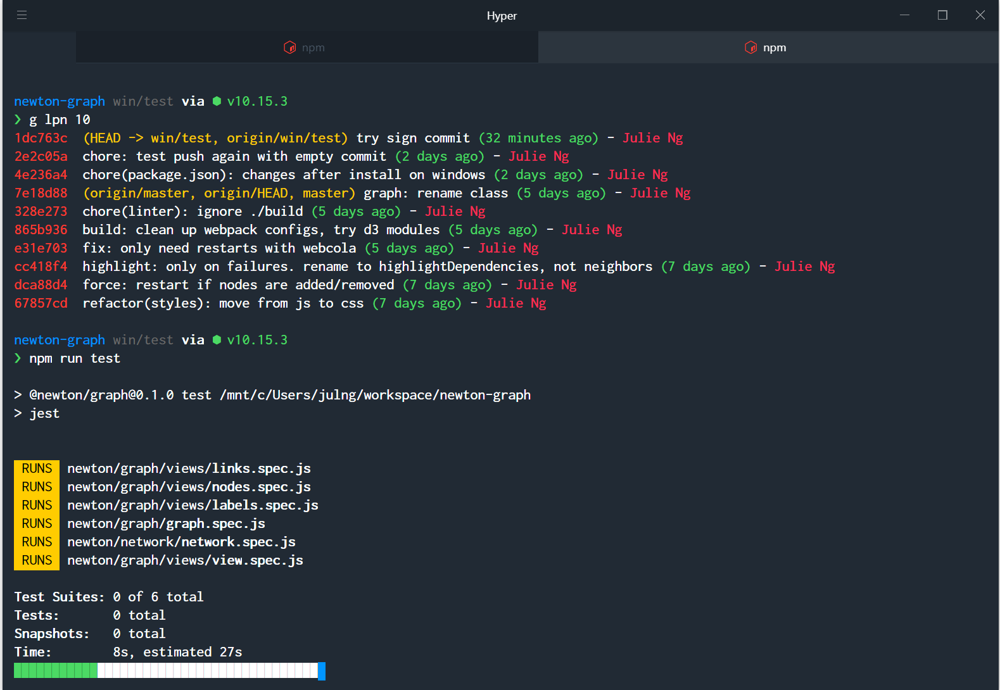

# Julie's Bash on Windows

When a mac developer codes on a Windows...

### Highlights

- Ubuntu - Linux Subsystem on Window (WSL)
- Oh My ZSH
- Spaceship Prompt - with minimalist ui
- Hyper.js Terminal - for tabs and styling
- Node.js and [n](https://github.com/tj/n) for version management
- git
	- login with encrypted `.netrc`
	- sign commits by default




## Setting up Linux on Windows

1. Enable feature. Inside Powershell (right click windows symbol), type:

	```
	Enable-WindowsOptionalFeature -Online -FeatureName Microsoft-Windows-Subsystem-Linux
	```

1. Install Ubuntu from Windows App Store. 
	Note: you will be prompted to create a separate user and password for the linux subsystem.

1. Update Ubuntu - install latest versions of dependencies, etc.

	```
	sudo apt update
	sudo apt upgrade
	```

1. Install [essential developer tools]((https://blogs.windows.com/buildingapps/2016/07/22/fun-with-the-windows-subsystem-for-linux/)) incl. gcc and make, which are required later.

	```
	sudo apt install build-essential
	```

1. Install [git](https://git-scm.com/) 

	```
	sudo apt install git
	```

## Installing Node.js

1. Install Node Version Manager

	We will use [n](https://github.com/tj/n) to manage versions of node.js. To install, we need to run:

	```
	curl -L https://git.io/n-install | bash
	```

	Note: this may fail if `build-essential` tools are not installed in previous step.

2. Install latest Node.js LTS version:

	```
	n lts
	```

3. Check everything works:

	```
	npm --version
	node --version
	```

	If it doesn't check that `~/n/bin` is in your `$PATH`.

## Customizing the Shell

1. Install Oh My ZSH
	```
	sh -c "$(curl -fsSL https://raw.githubusercontent.com/robbyrussell/oh-my-zsh/master/tools/install.sh)"
	```
1. Install the [Hyper.js Terminal](https://hyper.is/)
1. Install Powerline Fonts [per these instructions](https://medium.com/@slmeng/how-to-install-powerline-fonts-in-windows-b2eedecace58):
	1) Download fonts from [github.com/powerline/fonts](https://github.com/powerline/fonts) and navigate to the folder in Powershell.
	1) Inside Powershell: `Set-ExecutionPolicy Bypass`
	1) Run `.\install.ps1` to install all fonts at once. Might take a few minutes
	1) Inside Powershell: `Set-ExecutionPolicy Default`
1. Install [Spaceship prompt](https://github.com/denysdovhan/spaceship-prompt)
	```
	npm install -g spaceship-prompt
	```

### Customize  Hyper.js

Open the Hyper app. Then open up preferences via the Hamburger menu or by pressing `Ctrl` + `,` (comma)

Copy the contents of the [.hyper.js file in this repository](./.hyper.js), which changes the shell to `C:\\Windows\\System32\\bash.exe`

and adds the following plugins

- [verminal](https://www.npmjs.com/package/verminal) color scheme
- [hyper-tabs-enhanced](https://www.npmjs.com/package/hyper-tabs-enhanced)
- [hyper-hide-scroll](https://www.npmjs.com/package/hyper-tabs-enhanced)

The other customizations are cosmetic.

Note: Hyper.js is not installed in your linux home, but rather at your Windows home: `/mnt/c/Users/<username>`


### Install custom dotfiles

Copy these files into your home directory, aka `~`, which should be `/home/<username>`:

- [.bash_aliases](./.bash_aliases)
- [.zshrc](./.zshrc), which also configures spaceship prompt
- [.gitconfig](./.gitconfig)

## Setup GPG, save GitHub Credentials

1. Create `.netrc`

	Inside your `~` home directory, create a `.netrc` file with the following contents (password is plain text):

	```
	machine github.com
	login <USERNAME>
	Password <PASSWORD>
	```

1. Generate GPG Key

	```
	gpg --gen-key
	```

	which will prompt you for name, email and secret.

1. Encrypt `.netrc`

	Now encrypt it using the gpg key, where `<EMAIL>` is the address you used when creating the key

	```
	gpg -e -r <EMAIL> ~/.netrc
	```

1. Add credential Helper

	Inside your `~` home folder, create a new folder

	```
	mkdir ~/bin
	```

	and then download the credential helper:

	```
	curl -o ~/bin/git-credential-netrc https://raw.githubusercontent.com/git/git/master/contrib/credential/netrc/git-credential-netrc
	```

	give it executable permissions:

	```
	chmod 755 ~/bin/git-credential-netrc
	```

	Verify the following is in your `.zshrc`:
	```
	export PATH=$HOME/bin:$PATH
	export GPG_TTY=$(tty)
	```

1. Configure git to use credential helper

	```
	git config --global credential.helper "netrc -f ~/.netrc.gpg -v"
	```

1. Configure git to automatically sign commits

	```
	git config --global commit.gpgsign true
	```

	For details about adding the public key to your GitHub.com profile, see:
	- [GitHub Help: Generating a new GPG key](https://help.github.com/en/articles/generating-a-new-gpg-key)
	- [GitHub Help: Signing Commits](https://help.github.com/en/articles/signing-commits)

## References

- [Webdev on Windows with WSL and VS Code](https://daverupert.com/2018/04/developing-on-windows-with-wsl-and-visual-studio-code/)
- [Hyper.js + Oh My ZSH as Ubuntu on Windows (WSL) Terminal](https://medium.com/@ssharizal/hyper-js-oh-my-zsh-as-ubuntu-on-windows-wsl-terminal-8bf577cdbd97)